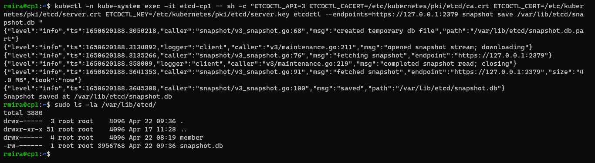

# Backup the etcd database

Periodically backing up the etcd cluster data is important to recover Kubernetes clusters under disaster scenarios, such as losing all control plane nodes. Before upgrading the cluster, it's a good idea to backup the cluster state.

To backup the etcd database, we'll use the snapshot feature.The snapshot file created contains all the Kubernetes states and critical information.

## The etcd data directory

When first started, etcd stores its configuration into a data directory. To find where the data directory is, we can consult the `etcd.yaml` manifest file.

`sudo grep data-dir /etc/kubernetes/manifests/etcd.yaml`

The output will tell us that the data directory is `/var/lib/etcd`.

## etcdctl

We can use the [etcdctl](https://etcd.io/docs/v3.4/dev-guide/interacting_v3/) tool to interact with the `etcd` container. We can log into the `etcd` container and explore some of the functionalities of `etcdctl`.

To access `etcd` we run the following. The command prompt will change.

`kubectl -n kube-system exec -it etcd-cp1 -- sh`

`etcd-cp1` is the container name in my case. My control plane node is called `cp1`. Yours would be different.

I didn't explore much, just ran one or two commands. There isn't much you can do, since not all commands are available. I consulted the help documentation, and gave it a quick read.

`etcdctl -h`

To establish a secure connection to the `etcd` container, we need to pass some files as parameters when we run the etcdctl commands. These files are inside the `/etc/kubernetes/pki/etcd` directory. We can't really use the `ls` command, so we simply echo the contents of the directory. You'll see these files inside.

`ca.crt ca.key healthcheck-client.crt healthcheck-client.key peer.crt peer.key server.crt server.key`

We'll need these for the next steps.

To exit the container, type `exit`.

## Checking the health of the database

We can check the health of the database using the loopback IP and port 2379. We'll need to pass the peer cert and key as well as the Certificate Authority as environmental variables.

`kubectl -n kube-system exec -it etcd-cp1 -- sh -c "ETCDCTL_API=3 ETCDCTL_CACERT=/etc/kubernetes/pki/etcd/ca.crt ETCDCTL_CERT=/etc/kubernetes/pki/etcd/server.crt ETCDCTL_KEY=/etc/kubernetes/pki/etcd/server.key etcdctl endpoint health"`

We should receive a response telling our database is healthy.

## Finding the number of databases that form the cluster

In a production environment, three or five databases are most common. In this lab environment there's only one database, though. We can obtain this information in a very friendly table format.

`kubectl -n kube-system exec -it etcd-cp1 -- sh -c "ETCDCTL_API=3 ETCDCTL_CACERT=/etc/kubernetes/pki/etcd/ca.crt ETCDCTL_CERT=/etc/kubernetes/pki/etcd/server.crt ETCDCTL_KEY=/etc/kubernetes/pki/etcd/server.key etcdctl --endpoints=https://127.0.0.1:2379 member list -w table"`

## Backing up the database

We can back up the database. To do that, we'll use the `snapshot` argument to save the snapshot into the container data directory `/var/lib/etcd/`. We'll save it as a file called `snapshot.db`.

`kubectl -n kube-system exec -it etcd-cp1 -- sh -c "ETCDCTL_API=3 ETCDCTL_CACERT=/etc/kubernetes/pki/etcd/ca.crt ETCDCTL_CERT=/etc/kubernetes/pki/etcd/server.crt ETCDCTL_KEY=/etc/kubernetes/pki/etcd/server.key etcdctl --endpoints=https://127.0.0.1:2379 snapshot save /var/lib/etcd/snapshot.db "`

Here we can see the result of the command and the newly created file.

## Backing up the snapshot

Now we can perform a back up of the snapshot and other information used to configure the cluster.

`mkdir $HOME/backup`
`sudo cp /var/lib/etcd/snapshot.db $HOME/backup/snapshot.db-$(date +%m-%d-%y)`
`sudo cp /root/kubeadm-config.yaml $HOME/backup/`
`sudo cp -r /etc/kubernetes/pki/etcd $HOME/backup/`

It's highly recommended to do this on a regular basis.

I still need to study how to restore the database from the snapshot. I'll update this section soon.

**NEXT:** [Upgrading the cluster](upgrade_cluster.md)

[Intercating with etcd](https://etcd.io/docs/v3.5/dev-guide/interacting_v3/)
