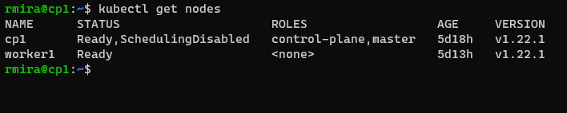
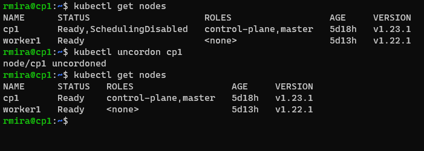

# Upgrading the cluster

We'll start working on our control plane node. As always, the first thing we need to do is to update the package metadata.

`sudo apt update`

In the previous lab, we held the **kubeadm** in place, so it wouldn't update. Let's remove the hold.

`sudo apt-mark unhold kubeadm`

Next, we'll update **kubeadm**. There are a number of available versions and we can list them with the following command.

`sudo apt-cache madison kubeadm`

The instructions in this lab say we should upgrade our cluster to the immediate next full version from the one we have installed. Since I had **1.22.1**, I chose to upgrade to **1.23.1**.

`sudo apt install -y kubeadm=1.23.1-00`

To prepare the control plane node for the update, we first need to run `kubectl drain`. The *drain* evicts or deletes all pods except mirror pods (which cannot be deleted through the API server) and marks the node as unschedulable (*cordons* the node). If there are daemon set-managed pods, drain will not proceed without `--ignore-daemonsets`.

`kubectl drain cp1 --ignore-daemonsets`

Before actually upgrading the cluster, we can check the upgrade plan.

`sudo kubeadm upgrade plan`

To perform the upgrade.

`sudo kubeadm upgrade apply v1.23.1`

`kubeadm` has been successfully upgraded, but we still need to upgrade the other tools.

If we run `kubectl get nodes` now we'll still see the old version. We'll also see `SchedulingDisabled` under status. That's because the node has been cordoned when we drained it.

We'll now upgrade `kubectl` and `kubelet` to the same version as `kubeadm`. But first we need to unhold them. When we're done with the upgrade, we'll hold them again

`sudo apt-mark unhold kubelet kubectl`
`sudo apt install -y kubelet=1.23.1-00 kubectl=1.23.1-00`
`sudo apt-mark hold kubelet kubectl`

We'll now restart the daemons.

`sudo systemctl daemon-reload`
`sudo systemctl restart kubelet`

If we run `kubectl get nodes` now we'll see it's now running the new version, but the control plane's status is still set as unavailable for scheduling. To make it available again, we'll uncordon it.

`kubectl uncordon cp1`

## Updating the worker node

We'll now connect to the worker node and update it.

`sudo apt update`
`sudo apt-mark unhold kubeadm`
`sudo apt install -y kubeadm=1.23.1-00`
`sudo apt-mark hold kubeadm`

### Draining the worker node from the control plane

**Back to the control plane node**, we'll drain the worker node.

`kubectl drain worker1 --ignore-daemonsets`

### Upgrade the worker node

**We'll move once again to the worker node** and perform the upgrade.

`sudo kubeadm upgrade node`

Now we'll upgrade `kubectl` and `kubelet`.

`sudo apt-mark unhold kubelet kubectl`
`sudo apt install -y kubelet=1.23.1-00 kubectl=1.23.1-00`
`sudo apt-mark hold kubelet kubectl`

### Restarting the daemon processes

`sudo systemctl daemon-reload`
`sudo systemctl restart kubelet`

## Checking the status on the control plane

We're now back at the control plane node. We need to uncordon the worker node for it to be available for scheduling.

`kubectl uncordon worker1`

If we run a `kubectl get nodes` now, we'll see the status of both the cp and the worker nodes are set to ready and both are running the 1.23.1 version.
