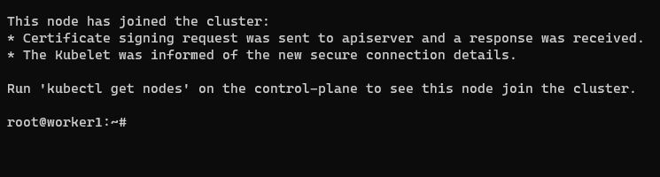
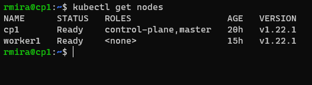

# Configuring the worker node

The worker node is where the applications will run. I had already set up an Ubuntu VM to act as the worker node. Let's connect to it to start setting up the worker node.

Some of the steps are the same as the ones we took to configure the control plane, so it should be easier and faster this time.

Some of the commands listed here are to be executed in the VM running the control plane. To know the difference, you'll see **worker** and **cp** in the command prompt. You'll immediately know where the command should be executed. For this lab, I became root from the very beginning.

`user@worker:~$ sudo -i`
`root@worker:~# apt update`
`root@worker:~# apt upgrade`

## Install Docker

`root@worker:~# apt install docker.io`

We'll use the same `daemon.json` file as the one from the cp.

`root@worker:~# nano /etc/docker/daemon.json`

```json
{
    "exec-opts": ["native.cgroupdriver=systemd"],
    "log-driver": "json-file",
    "log-opts": {
        "max-size": "100m"
    },
    "storage-driver": "overlay2"
}
```

`root@worker:~# systemctl restart docker`

## Install Kubernetes

`root@worker:~# nano /etc/apt/sources.list.d/kubernetes.list`

`deb http://apt.kubernetes.io/ kubernetes-xenial main`

`root@worker:˜# curl -s https://packages.cloud.google.com/apt/doc/apt-key.gpg | apt-key add -`

`root@worker:˜# apt update`

`root@worker:˜# apt install -y kubeadm=1.22.1-00 kubelet=1.22.1-00 kubectl=1.22.1-00`

`root@worker:˜# apt-mark hold kubeadm kubelet kubectl`

## Add a local DNS alias for the cp server

Take note of the cp server's private IP address and add it, along with an alias to the `/etc/hosts` file. Consult the previous chapter to see how the file should look like.

`user@worker:˜# nano /etc/hosts`

## Join the worker node to the cluster

Now things start to differ.

To join this worker node to the Kubernetes cluster, we'll need to establish trust. Both cp and worker node have to trust each other. We'll use a shared token and a discovery-token-ca-cert-hash to validate the public key of the root certificate authority (CA) presented by the Kubernetes control plane.

Now we move on to the control plane to obtain the shared token and the discovery-token-ca-cert-hash.

### To get the shared token

`user@cp:˜$ sudo kubeadm token list`

### To get the discovery-token-ca-cert-hash

`student@cp:˜$ openssl x509 -pubkey -in /etc/kubernetes/pki/ca.crt | openssl rsa -pubin -outform der 2>/dev/null | openssl dgst -sha256 -hex | sed 's/ˆ.* //'`

### Join the worker node

Back to the worker node, we'll now join it to the cluster. For that we'll run the `kubeadm join` command. We'll use the shared token and the hash obtained in the previous steps and we'll also add the cp server's private IP address, but we'll use the alias we defined above, not the actual IP address.

`root@worker:˜# kubeadm join --token tokenvalue k8scp:6443 --discovery-token-ca-cert-hash sha256:discoverycacerthashvalue`

This is what you should see as the output.



Back to the cp server, we run `kubectl get nodes` to see our worker node ready to start working as a member of the cluster.



**NEXT:** [Deploying a simple application](deploy_app.md)
