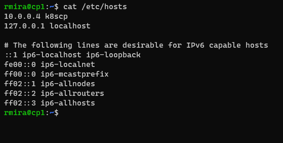
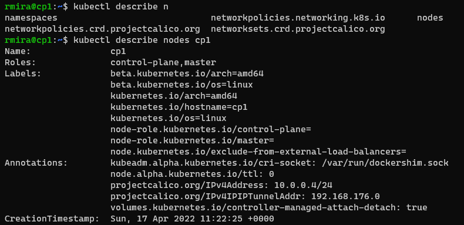

# Configuring the control plane

Because I had already set the SSH config file for all the hosts I need to connect to, I just need to type this to access my VM that will act as the control plane.

`ssh cp1`

Once inside, the very first thing we need to do is to update and upgrade the system.

`sudo apt update`
`sudo apt upgrade -y`

## Install Docker

There are a number of choices for container environment, the main ones being **Docker**, **containerd**, and **cri-o**. I see a lot of people using **cri-o**, but from what I could gather from the labs I took, **Docker** is simpler. I chose **Docker**.

`sudo apt install -y docker.io`

## Add a new repo for Kubernetes

We'll update the APT Package Index, and include the Kubernetes repositories. To do that, we need to update the `/etc/apt/sources.list.d` directory. We'll create a new file in this directory called `kubernetes.list`. I used **nano** for this.

`sudo nano /etc/apt/sources.list.d/kubernetes.list`

We'll add the following to the newly created file:

`deb http://apt.kubernetes.io/ kubernetes-xenial main`

## Add a GPG key for the Kubernetes packages

To run this, we need to be **root**, just typing sudo won't do. To become root, we type this:

`sudo -i`

Now we can run the command below.

`curl -s https://packages.cloud.google.com/apt/doc/apt-key.gpg | apt-key add -`

Now we run `apt update` again. This will download the new repo data.

`apt update`

From this point onwards, I just continued being root. You won't see any sudo in front of the commands.

## Install kubeadm, kubectl and kubelet

- `kubectl` is the command-line tool that allows us to run commands against Kubernetes clusters.
- `kubeadm` is a tool for installing Kubernetes and for setting up a secure cluster.
- The `kubelet` is the primary *node agent* that runs on each node.

`apt install -y kubeadm=1.22.1-00 kubelet=1.22.1-00 kubectl=1.22.1-00`

There are newer versions, but I chose this to follow the instructions from the lab.

To hold the installed version in place, we run `apt-mark hold`. This command blocks the packages from being upgraded.

`sudo apt-mark hold kubelet kubeadm kubectl`

## Cluster networking

For the labs, I followed the instructions and used [Calico](https://www.tigera.io/project-calico/) to implement networking. This is a topic I need to dive deeper.

We'll deploy Calico using a sample manifest downloaded from the Calico website.

`wget https://docs.projectcalico.org/manifests/calico.yaml`

This file is huge, with lots of configuration settings. For the moment, the setting we need to find is the `CALICO_IPV4POOL_CIDR`. We'll take note of this value and use it in a while.

## Add a local DNS alias to the control plane server

To do that, we'll add an entry to the `/etc/hosts` file.

First, we'll find the IP address of the primary interface.

`hostname -i`

We'll copy this value and add to the `/etc/hosts` file. I named the alias **k8scp**.

Your file should look like this:



## Create a configuration file for the cluster

There are many settings to include, but for this beginner tutorial, I defined only the **control plane endpoint**, the **software version** to deploy, and **podSubnet** values.

First we'll configure Docker to use the proper cgroup driver. For that, we'll create a new file called `daemon.json`.

`nano /etc/docker/daemon.json`

This is the content of the file:

```json
{
    "exec-opts": ["native.cgroupdriver=systemd"],
    "log-driver": "json-file",
    "log-opts": {
        "max-size": "100m"
    },
    "storage-driver": "overlay2"
}
```

We'll restart the `docker` service.

`systemctl restart docker`

Let's create the **kubeadm** file to initialize the cluster.

`nano kubeadm-config.yaml`

The file looks like this:

```yaml
apiVersion: kubeadm.k8s.io/v1beta2
kind: ClusterConfiguration
kubernetesVersion: 1.22.1
controlPlaneEndpoint: "k8scp:6443"
networking:
  podSubnet: 192.168.0.0/16
```

## Initialize the control plane

We'll use the `kubeadm` utility to initialize the control plane.

`kubeadm init --config=kubeadm-config.yaml --upload-certs | tee kubeadm-init.out`

The command after the pipe saves the output of the command.

You should see this:


We now go back to being a regular user to run the following commands, as indicated in the output of `kubeadm init`. To quit being root, simply type `exit`.

`mkdir -p $HOME/.kube`
`sudo cp -i /etc/kubernetes/admin.conf $HOME/.kube/config`
`sudo chown $(id -u):$(id -g) $HOME/.kube/config`

## Apply the network plugin configuration to the cluster

`sudo cp /root/calico.yaml .`
`kubectl apply -f calico.yaml`

## Enable bash autocompletion

This is super helpful. There's a kubectl completion script that you can enable. For it to be persistent throughout all shell sessions, we need to source it to the `.bashrc` file.

`sudo apt install bash-completion -y`

Exit the session and log back in.

`source <(kubectl completion bash)`
`echo "source <(kubectl completion bash)" >> $HOME/.bashrc`

Now we can hit the Tab button to autocomplete the kubectl commands.



**NEXT**: [Configuring the worker node](configure_worker.md)
