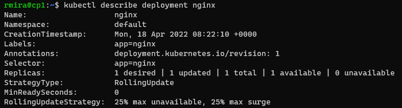
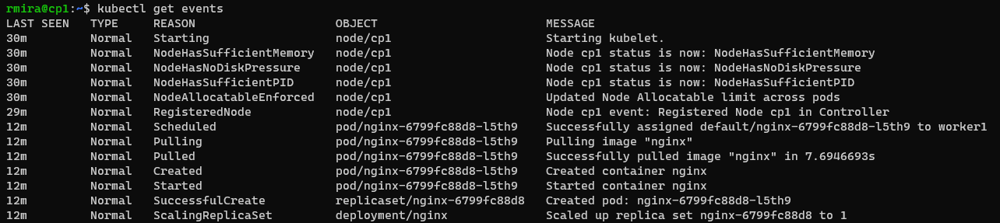

# Deploying a simple application

For this lab we'll deploy an NGINX web server. This will happen at the control plane.

We'll create a **Kubernetes Deployment** configuration, which instructs Kubernetes how to create and update instances of our application. Once the Deployment is created, the Kubernetes control plane schedules the application instances included in that Deployment to run on individual Nodes in the cluster.

`kubectl create deployment nginx --image=nginx`

The command above will pull an NGINX image and create a container. 

To check the deployment we run the following:

`kubectl get deployments`

And to see the details about this specific deployment, we run the following:

`kubectl describe deployment nginx`

We can see the steps the cluster took to pull and deploy the nginx app by running `kubectl get events`

## Deploying an app from a manifest file

We can define our deployment declaratively in a yaml file and post it to the api-server. For this lab, we'll create a yaml file from the output of our deployment.

We'll output the deployment in yaml format and send it to a file, like so:

`kubectl get deployment nginx -o yaml > first.yaml`

In order to use this file for later deployments, we need to do some editing. We'll remove the `creationTimestamp`, `resourceVersion`, and `uid` lines. We also need to remove everything after `status`, including the word `status` itself. We'll also add port information for the container, so we can access it later. Check lines *34* and *35* in the file.

The edited yaml file, ready to be used for deployments, is [here](../yaml_files/first.yaml).

We'll delete the existing deployment and create a new one from our yaml file.

`kubectl delete deployment nginx`
`kubectl create -f first.yaml`

## Creating a service object that exposes the deployment

`kubectl expose deployment/nginx`
